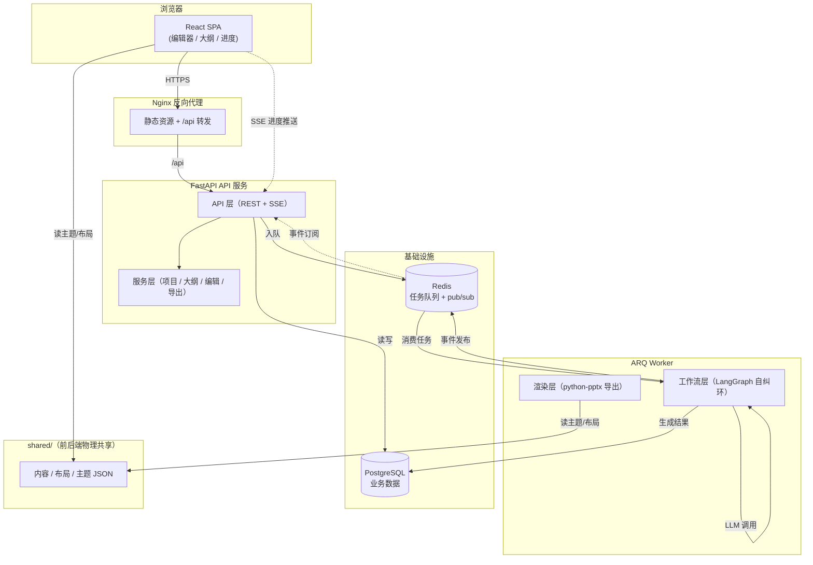
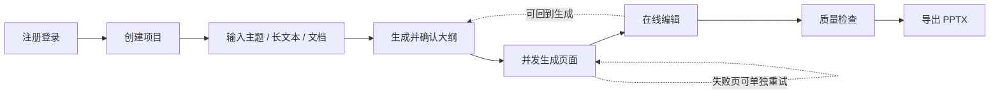
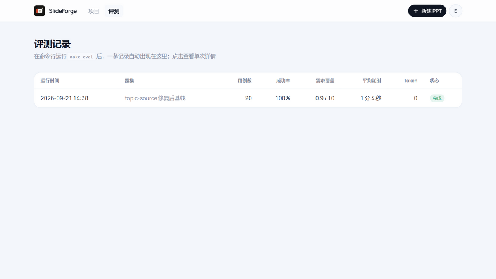
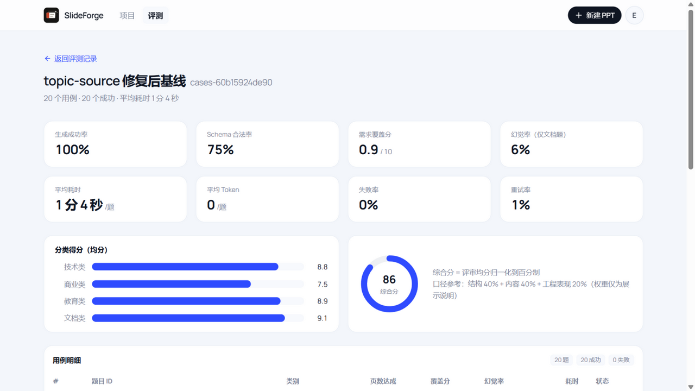

# SlideForge · AI PPT 生成器

输入一句主题、粘贴一段长文本，或者上传 PDF、Word、Markdown、TXT 文档，先生成一份可修改的大纲，再并发生成完整页面，最终导出原生可编辑的 PPTX 文件。

## 一、项目介绍

这是一个以 **AI 工程化 + 文档渲染 + 异步任务编排** 为核心的全栈项目，基于 FastAPI + LangChain + LangGraph + python-pptx + React 开发。

### 4 大核心能力

1）**多种输入生成大纲**

项目支持从主题、长文本和文档三种入口创建 PPT。用户可以控制页数、排版模式、文字量、语气和目标受众。模型不会直接越过用户生成最终页面，而是先产出结构化大纲，标题、页面目标和要点都能修改，也可以增删页面、调整顺序，再决定是否开始生成。

2）**异步并发生成**

一份 10 页 PPT 如果串行调用模型，很容易让请求等待一分钟以上。项目把每一页拆成独立任务，通过 ARQ Worker 并发执行，用 Redis 保存任务状态并传递事件，前端通过 SSE 实时接收进度。生成过程中，已经完成的页面可以立即预览，失败页面可以单独重试，用户也可以软取消剩余任务，不需要整份重来。

3）**在线编辑**

生成后的内容会回到结构化模型里编辑，编辑器左侧是页面缩略图，中间是 16:9 画布，右侧提供 AI 修改、主题、版式和图片面板。文字可以直接编辑；灵活排版页面支持拖动分隔线、调整内容块尺寸、跨容器移动和更换排布；主题切换后，Web 预览和 PPTX 导出会读取同一份主题数据。

4）**原生 PPTX 导出**

AI 输出的文字长度不可预测，直接导出很容易出现溢出、缺页或整页被渲染成图片的问题。项目在导出前检查结构、文字占用、数字来源和页面边界，把问题分成 error 和 warning：error 阻断导出，warning 提醒用户核对但允许继续。通过检查后，后端用 python-pptx 逐块构造文本框、表格、图表和图片，再回读生成的文件进行验证。这样得到的 PPTX 不是一张铺满全页的截图，而是能继续修改的原生对象。

## 二、技术要点

项目在 AI 工程化、异步编排、文档渲染、前端编辑器、工程质量 5 个方向都有完整实践：

- 基于 LangChain LCEL + `with_structured_output` 实现 AI 结构化输出，保证模型输出始终可用
- 基于 LangGraph 构建自纠环工作流，系统性提升单页生成质量
- 设计 AI 工具调用机制，让模型通过 `bind_tools` 调用编辑工具修改页面
- 使用 ARQ + asyncio.Semaphore 实现页级并发生成，控制模型调用频率
- 通过 Redis pub/sub + SSE 实现实时进度推送和断线重连恢复
- 设计内容、布局、主题三分离的数据模型，让 Web 和 PPTX 同源渲染
- 用 python-pptx 构造原生可编辑的 PPTX，处理中文字体和 emoji
- 用受约束的 contenteditable 实现结构化编辑器，保证光标稳定
- 通过 revision 乐观锁 + 按页串行保存队列处理编辑冲突
- 用 FontTools 做字形级文字溢出检测，配合 warning/error 分级门禁
- 从 OpenAPI 生成前端 TypeScript 类型，消灭前后端接口漂移
- 用布局树 + solver 实现灵活排版，并保证前后端求解器双端一致

## 三、架构说明

该项目功能完整，涵盖用户项目管理、输入解析、大纲生成、页面生成、在线编辑、主题布局、图片管线、导出质量检查 8 大模块。

本项目采用前后端分离 + 异步 Worker 架构。前端是 React + TypeScript SPA，后端是 FastAPI + ARQ Worker 服务，通过 REST API + SSE 通信。

后端内部按照 API 层、领域层、工作流层、渲染层分层，耗时的 AI 任务通过 ARQ 异步队列和 Redis pub/sub 来管理。内容、布局、主题三种数据通过 `shared/` 目录下的 JSON 文件前后端物理共享。



项目的核心业务流程：注册登录 → 创建项目 → 输入主题或材料 → 生成并确认大纲 → 并发生成页面 → 在线编辑 → 质量检查 → 导出 PPTX。



## 四、评测体系：用数据证明它好用

AI 生成类项目最常被问的一个问题是：「你说它好用，怎么证明？」单元测试能证明代码没有低级错误，但证明不了**生成质量**——一份 PPT 的内容全不全、数字有没有编、结构合不合法，只有真跑一遍才知道。为此项目内置了一套评测体系（Eval Harness）：20 道固定题目的基准集，驱动**真实运行的服务**完整走一遍生成主流程，从结构、内容、幻觉三个维度打分，结果落库并在前端出报告页。

一句话使用：`make eval`，约一小时后，一份可复现的质量报告自动出现在数据库和前端「评测」页。



### 它是怎么跑起来的

1. **基准题集**：20 道题分四类（技术 / 商业 / 教育 / 文档），15 道只给一句主题，5 道给一份带数字的材料文档。题目就是 `backend/eval/cases/` 下的普通数据文件，**加一道题 = 加一个文件**；题集内容算版本哈希，换题后报告自动区分新旧口径。
2. **驱动真实栈**：评测器不调内部函数，而是像真实用户一样走 HTTP API——注册账号、建项目、传材料、生成并确认大纲、并发生成页面、导出 PPTX。相当于每次评测都顺带做了一次端到端回归（API → 任务队列 → Worker → LLM → 导出）。
3. **三路打分**：
   - **结构**：复用产品自身的导出前检查（schema 合法性、页数达成、导出成功）；
   - **内容**：LLM Judge 按题面要求逐条核对覆盖度并打 0-10 分；
   - **幻觉**：文档题里出现的每个数字回源核对，材料里没有的记为编造。
4. **报告留存**：结果写入 `eval_runs` 表（含 20 行逐题明细与分类得分），前端「评测」页可查历史记录与单次详情。



### 为什么只看这几个指标

| 指标 | 当前基线 | 为什么选它 |
|---|---|---|
| 生成成功率 | **100%**（20/20） | 端到端可用性的底线：模型调用失败、超时、导出失败都算不成功 |
| 页数达成率 | 100% | 用户要 8 页就给 8 页，是最容易感知的「听话程度」 |
| Schema 合法率 | 75% | 结构化输出是整个产品的前提，合法率掉了后面全塌 |
| 需求覆盖分 | 覆盖 93.3%，均分 **8.6/10** | 防「跑通了但答非所问」：judge 逐条核对题面要求是否被覆盖 |
| 幻觉率（文档题） | **6.4%**（9/141 个数字） | PPT 是要拿出去讲的，编造数字是最严重的质量事故，必须单独盯 |
| 平均耗时 / 重试率 | 64 秒/题，1.1% | 工程性能与稳定性：体验和可靠性也是产品质量的一部分 |

> 基线环境：DeepSeek 单模型、20 题、2026-09；综合分 86/100（评审均分归一化）。当前有 5 题触发了导出前检查的 error 级问题、被如实记为结构不合法——评测不是来报喜的，它把这 5 题暴露出来正是它的价值。

### 已知口径与局限（诚实声明）

- **Token 数恒为 0**：埋点在 Worker 进程内，HTTP 驱动的评测器取不到，v1 口径如此；
- **幻觉核对是子串级**的，不懂语义也不懂换算（材料写「1.86 亿」、页面写「18600 万」会被误记为编造）；
- **重试率是近似值**：任务队列层的重试对 HTTP 不可见，按「生成阶段出现过失败状态的页数 / 总页数」估算；
- **无硬门禁**：指标不达标不影响评测退出码，评测只观测、不阻断——它衡量产品，不改变产品。

### 欢迎二次开发

评测体系是开放的：想评你自己的场景，往 `backend/eval/cases/` 扔几个 Markdown/题目文件就行；想换判分模型或加指标，`app/eval/` 下每个模块都是独立可改的。跑 `make eval` 之前记得先起好 API 和 Worker（见下节快速运行）。

## 五、快速运行

### 前置条件

- Python >= 3.12、[uv](https://docs.astral.sh/uv/getting-started/installation/) >= 0.6
- Node.js >= 20
- Docker（运行 PostgreSQL + Redis）
- 一个 [DeepSeek API Key](https://platform.deepseek.com/)（✅ 必需，用于 AI 生成大纲和页面）
- 一个 [OpenAI](https://platform.openai.com/) 或 [阿里云百炼](https://bailian.console.aliyun.com/) API Key（🔧 可选，用于 AI 生图，不配则走占位图）
- 一个 [Unsplash Access Key](https://unsplash.com/developers)（🔧 可选，AI 生图失败时降级到图库检索）

### 1. 克隆项目

```bash
git clone <你的仓库地址>
cd SlideForge
```

### 2. 配置环境变量

```bash
cp backend/.env.example backend/.env
# 编辑 backend/.env，至少填写 LLM_API_KEY
```

> 第一次跑通只需要填 `LLM_API_KEY` 这一个值，其余全部保持默认。

### 3. 启动基础设施 + 安装依赖 + 数据库迁移

```bash
make up        # 启动 PostgreSQL + Redis 容器
make install   # 安装后端 (uv sync) + 前端 (npm install) 依赖
make migrate   # Alembic 数据库迁移，自动建表
```

> Windows 没有 make 可对照 Makefile 执行完整命令，如 `make up` = `docker compose up -d`。

### 4. 启动项目（三个终端）

```bash
make dev-api      # 终端一：API http://127.0.0.1:39800
make dev-worker   # 终端二：Worker（不启动则生成卡 0%）
make dev-web      # 终端三：前端 http://localhost:39173
```

### 5. 下载度量字体（可选）

```bash
make fonts     # Noto Sans / Noto Sans SC，供文字溢出检测
```

不下载不影响运行，溢出检测走估算路径，导出前检查会多一条 warning。

### 6. 运行测试

```bash
make test         # 后端 pytest，不消耗 API 额度
make regression   # 固定语料回归集（需要先 make fonts）
make lint         # Ruff 静态检查
```

### 7. 部署

项目提供了 `docker-compose.prod.yml` + `backend/Dockerfile` + `nginx.conf`，可在任意安装了 Docker 的云服务器上一键拉起 Postgres + Redis + API + Worker + Nginx 五个容器。服务器上安全组放开 39880 端口，然后：

```bash
cp backend/.env.example backend/.env
# 生产环境必改：APP_ENV=production、LLM_API_KEY、JWT_SECRET（openssl rand -hex 32）

docker compose -f docker-compose.prod.yml up -d --build
docker compose -f docker-compose.prod.yml run --rm api uv run alembic upgrade head
```

浏览器打开 `http://你的公网IP:39880`。
